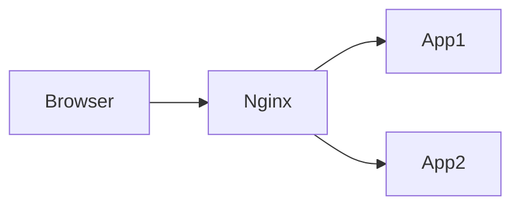

# Serving Next.js static HTML pages with Docker and Nginx

server-side routing을 이용해 마이크로 프론트엔드 아키텍쳐를 구현합니다.

## Overview


```mermaid
flowchart LR
    Browser --> Nginx
    Nginx --> App1
    Nginx --> App2
```

## Quick start

```
docker-compose up
```
